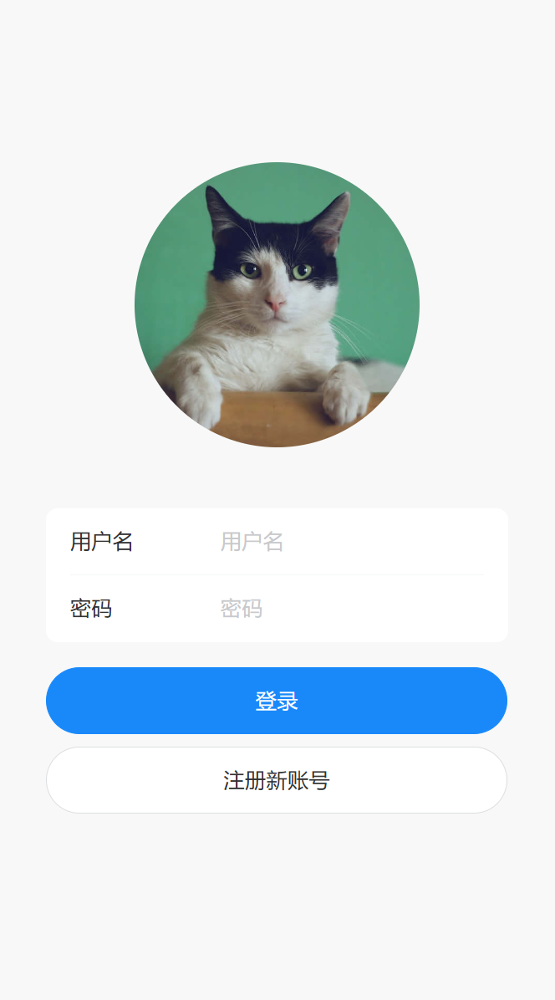
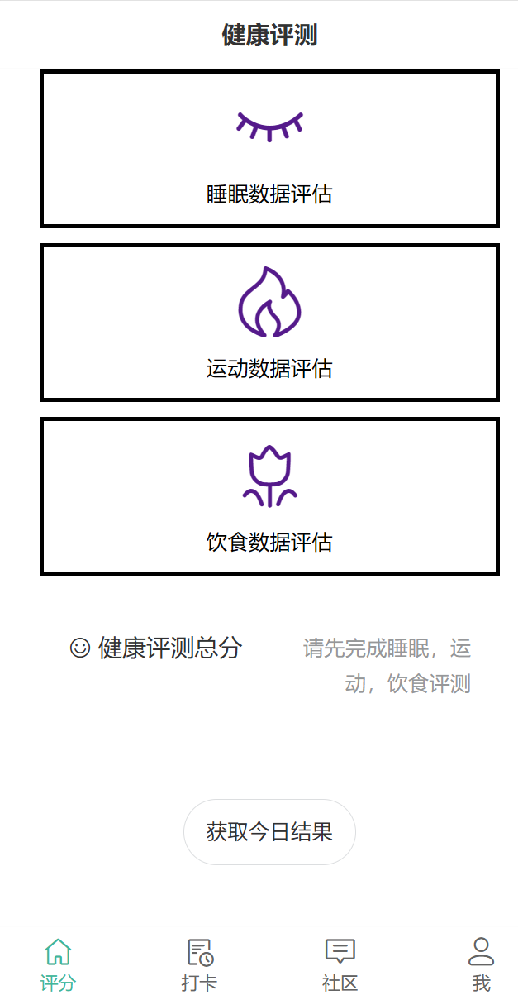
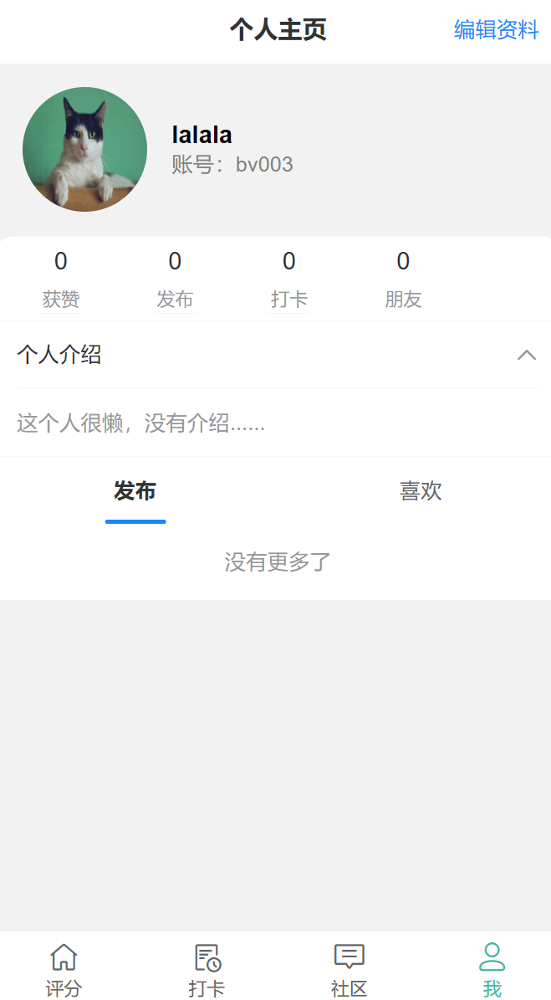

# Habit-Builders

A full-stack habit tracking application designed to help people build healthy habits, particularly for weight loss. This project was originally developed as a course assignment for Fundamentals of Software Construction.

---

## 📋 Table of Contents

- [Architecture Overview](#-architecture-overview)
- [Tech Stack](#-tech-stack)
- [Project Structure](#-project-structure)
- [Database Schema](#-database-schema)
- [API Endpoints](#-api-endpoints)
- [Frontend Routes](#-frontend-routes)
- [Key Features](#-key-features)
- [Setup & Development](#-setup--development)
- [Docker Deployment](#-docker-deployment)
- [Environment Variables](#-environment-variables)

---

## 🏗️ Architecture Overview

This is a **client-server architecture** with:

- **Backend**: ASP.NET Core 8.0 Web API with Entity Framework Core
- **Frontend**: Vue 3 + Vite SPA with Vant UI components
- **Database**: MySQL (accessed via MySQL.EntityFrameworkCore provider)
- **Communication**: RESTful API via HTTP/HTTPS

```
┌─────────────────┐      HTTP/REST       ┌─────────────────┐      SQL       ┌──────────────┐
│  Vue 3 Frontend │  ═══════════════════► │  .NET 8 Backend │  ═══════════►  │  MySQL DB    │
│  (Vite + Vant)  │                       │  (EF Core)      │                │  (rgUser)    │
└─────────────────┘                       └─────────────────┘                └──────────────┘
```

---

## 🛠️ Tech Stack

### Backend
| Technology | Version | Purpose |
|------------|---------|---------|
| .NET SDK | 8.0 | Runtime & Framework |
| ASP.NET Core | 8.0 | Web API framework |
| Entity Framework Core | 7.0.2 | ORM for database access |
| MySQL.EntityFrameworkCore | 7.0.2 | MySQL provider for EF Core |
| Swashbuckle.AspNetCore | 6.4.0 | Swagger/OpenAPI documentation |

### Frontend
| Technology | Version | Purpose |
|------------|---------|---------|
| Vue | 3.4.21 | Frontend framework |
| Vue Router | 4.3.2 | Client-side routing |
| Vite | 5.2.0 | Build tool & dev server |
| Vant | 4.9.0 | Mobile UI component library |
| Axios | 1.6.8 | HTTP client |
| amfe-flexible | 2.2.1 | Mobile viewport adaptation |

---

## 📁 Project Structure

```
Habit-Builders/
├── habitsBuilderBackEnd/           # .NET 8 Web API
│   ├── habitsBuilderBackEnd/
│   │   ├── Controllers/            # API Controllers
│   │   │   ├── UserController.cs   # User registration, login, friends
│   │   │   ├── RecordController.cs # Health scores tracking
│   │   │   ├── PostController.cs   # Community posts, likes, photos
│   │   │   └── CardController.cs   # Habit cards & checklists
│   │   ├── Models/                 # Entity Framework entities
│   │   │   ├── User.cs             # User entity
│   │   │   ├── Record.cs           # Daily health scores
│   │   │   ├── Post.cs             # Community posts
│   │   │   ├── HabitCard.cs        # Habit tracking cards
│   │   │   └── ChecklistItem.cs    # Individual checklist items
│   │   ├── DTO/                    # Data Transfer Objects
│   │   ├── Services/               # Business logic layer
│   │   │   ├── UserService.cs
│   │   │   ├── RecordService.cs
│   │   │   ├── PostService.cs
│   │   │   └── DailyTaskService.cs
│   │   ├── Repositories/           # Data access layer
│   │   │   └── RecordDbContext.cs  # EF Core DbContext
│   │   ├── appsettings.json        # Configuration (DB connection)
│   │   └── Program.cs              # App entry point
│   └── Dockerfile
│
└── habitsBuilderFrontEnd/          # Vue 3 SPA
    ├── src/
    │   ├── pages/                  # Page components
    │   │   ├── accessment/         # Health assessment pages
    │   │   │   ├── main.vue        # Assessment dashboard
    │   │   │   ├── diet.vue        # Diet scoring
    │   │   │   ├── sleep.vue       # Sleep scoring
    │   │   │   ├── sport.vue       # Exercise scoring
    │   │   │   └── history.vue     # Historical data
    │   │   ├── login/              # Authentication
    │   │   ├── habit/              # Habit tracking & AI
    │   │   ├── community/          # Social features
    │   │   └── user/               # User profile
    │   ├── components/             # Reusable components
    │   ├── router/index.js         # Route definitions
    │   ├── http/index.js           # Axios HTTP client
    │   └── state/state.js          # Global state management
    └── Dockerfile
```

---

## 🗄️ Database Schema

**Database**: `rgUser` (MySQL)

### Core Entities

```
┌─────────────┐       ┌─────────────┐       ┌─────────────┐
│    User     │◄──────┤  UserFriend │       │   Record    │
├─────────────┤       ├─────────────┤       ├─────────────┤
│ PK UserId   │       │ PK UserId   │       │ PK RecordId │
│   UserName  │       │ PK FriendId │       │ FK UserId   │
│   Password  │       └─────────────┘       │   dateTime  │
│   Friends   │                             │   sleepscore│
│   Posts     │       ┌─────────────┐       │   dietscore │
│   HabitCards│       │   HabitCard │       │   sportscore│
└─────────────┘       ├─────────────┤       │   totalscore│
       │              │ PK Id       │       └─────────────┘
       │              │ FK UserId   │
       │              │   Category  │       ┌─────────────┐
       │              │   Description│      │ChecklistItem│
       │              └─────────────┘       ├─────────────┤
       │                     │              │ PK Id       │
       │                     │              │ FK CardId   │
       │                     ▼              │   Content   │
       │              ┌─────────────┐       │   IsCompleted│
       └─────────────►│    Post     │       └─────────────┘
                      ├─────────────┤
                      │ PK PostId   │       ┌─────────────┐
                      │ FK UserId   │       │  PostLike   │
                      │   Content   │       ├─────────────┤
                      │   PostedAt  │       │ PK PostLikeId│
                      │   Photos    │◄──────┤ FK PostId   │
                      │   Likes     │◄──────┤ FK UserId   │
                      └─────────────┘       └─────────────┘
                             │
                             ▼
                      ┌─────────────┐
                      │  PostPhoto  │
                      ├─────────────┤
                      │ PK PostPhotoId
                      │ FK PostId   │
                      │   Url       │
                      └─────────────┘
```

### Entity Relationships
- **User** 1:N **Record** (One user has many daily records)
- **User** 1:N **HabitCard** (One user has many habit cards)
- **User** 1:N **Post** (One user can create many posts)
- **User** N:M **User** (Friendship - self-referencing many-to-many)
- **HabitCard** 1:N **ChecklistItem** (A card has multiple checklist items)
- **Post** 1:N **PostPhoto** (A post can have multiple photos)
- **Post** 1:N **PostLike** (A post can have multiple likes)

---

## 🔌 API Endpoints

Base URL: `/api`

### UserController (`/api/user`)
| Method | Endpoint | Description |
|--------|----------|-------------|
| POST | `/register` | Register new user |
| POST | `/login` | User login (returns success boolean) |
| GET | `/{id}` | Get user by ID |
| POST | `/{id}/update-password` | Update user password |
| POST | `/{id}/friends/{friendId}` | Add friend |
| DELETE | `/{id}/friends/{friendId}` | Remove friend |

### RecordController (`/api/record`)
| Method | Endpoint | Description |
|--------|----------|-------------|
| POST | `/dailytask` | Create/update daily record |
| GET | `/history` | Get user's historical records |
| POST | `/data` | Get records by date range |
| GET | `/sportdata` | Get exercise data |
| GET | `/dietdata` | Get diet data |

### PostController (`/api/post`)
| Method | Endpoint | Description |
|--------|----------|-------------|
| POST | `/` | Create new post |
| GET | `/{postId}` | Get post by ID |
| POST | `/{postId}/likes` | Like/unlike a post |

### CardController (`/api/card`)
| Method | Endpoint | Description |
|--------|----------|-------------|
| GET | `/{userId}` | Get user's habit cards |
| POST | `/{userId}` | Create new habit card |
| DELETE | `/{userId}` | Delete habit card |
| POST | `/{userId}/{cardId}/checklist` | Add checklist item |
| DELETE | `/{userId}/{cardId}/checklist/{itemId}` | Delete checklist item |

---

## 🌐 Frontend Routes

| Route | Component | Auth Required | Description |
|-------|-----------|---------------|-------------|
| `/` | `main.vue` | ✅ | Assessment dashboard |
| `/login` | `login.vue` | ❌ | User login & registration |
| `/accessment/diet` | `diet.vue` | ✅ | Diet assessment |
| `/accessment/sleep` | `sleep.vue` | ✅ | Sleep assessment |
| `/accessment/sport` | `sport.vue` | ✅ | Exercise assessment |
| `/accessment/history` | `history.vue` | ✅ | View historical data |
| `/community` | `community.vue` | ✅ | Community/feed |
| `/habit` | `habit.vue` | ✅ | Habit tracking |
| `/habit/ai` | `ai.vue` | ❌ | AI workout planner |
| `/user` | `user.vue` | ✅ | User profile |

---

## ✨ Key Features

### 1. User Management ✅
- Registration & login with **SHA256 password hashing**
- Input validation (username, nickname, password strength)
- Duplicate user detection
- Friend system (bidirectional friendship)

### 2. Health Assessment ✅
- Daily scoring for: Sleep, Diet, Exercise
- Aggregated total score calculation
- Historical data visualization

### 3. Habit Tracking ✅
- Custom habit cards with categories
- Checklist items for each habit
- Daily task completion tracking
- Streak calculation

### 4. Community ✅
- Post creation with photo uploads
- Like system for posts
- Social feed with pull-to-refresh
- View personal posts and liked posts

### 5. AI Features ✅
- AI-designed workout plans via Baidu API
- Configurable fitness goals and levels
- Gender-aware recommendations

---

## 🔐 Security Features

- ✅ **Password Hashing**: SHA256 hashing for password storage
- ✅ **Input Validation**: Server-side validation for all user inputs
- ✅ **Environment Variables**: API keys and secrets stored in env files
- ⚠️ **No JWT/Session**: Authentication is validated on each protected route via local state (suitable for course project scope)

---

## 🐳 Docker Deployment

### Prerequisites
- [Docker Desktop](https://www.docker.com/products/docker-desktop/) (or Docker Engine + Docker Compose)

### Quick Start

```bash
# Clone the repository
git clone https://github.com/yourusername/Habit-Builders.git
cd Habit-Builders

# Set up environment variables
cp .env.example .env
cp habitsBuilder/habitsBuilderFrontEnd/.env.example habitsBuilder/habitsBuilderFrontEnd/.env
# Edit .env files with your configuration

# Start all services (MySQL + Backend + Frontend)
docker-compose up --build

# Wait for the build to complete, then open:
# Frontend: http://localhost:5173
# Backend API: http://localhost:5000
# Swagger UI: http://localhost:5000/swagger
```

### Stop the Application

```bash
# Press Ctrl+C to stop, or in another terminal:
docker-compose down

# To also delete the database data:
docker-compose down -v
```

---

## 🚀 Setup & Development (Without Docker)

### Prerequisites
- .NET 8.0 SDK
- Node.js 20+
- MySQL Server

### Database Setup
```sql
-- Create database
CREATE DATABASE rgUser;
```

Update connection string in `habitsBuilderBackEnd/habitsBuilderBackEnd/appsettings.json`:
```json
{
  "ConnectionStrings": {
    "DB": "Server=localhost;Database=rgUser;User=your_user;Password=your_password"
  }
}
```

### Backend Development
```bash
cd habitsBuilder/habitsBuilderBackEnd/habitsBuilderBackEnd
dotnet restore
dotnet run
# API will be available at https://localhost:7001 or http://localhost:5000
# Swagger UI at /swagger
```

### Frontend Development
```bash
cd habitsBuilder/habitsBuilderFrontEnd
npm install
npm run dev
# Development server at http://localhost:5173
```

---

## 🔧 Environment Variables

### Backend (.env)
```env
# Database Connection String
ConnectionStrings__DB=Server=localhost;Database=rgUser;User=root;Password=your_password

# ASP.NET Core Environment
ASPNETCORE_ENVIRONMENT=Development
ASPNETCORE_URLS=http://+:5000
```

### Frontend (.env)
```env
# API Base URL
VITE_API_URL=http://localhost:5000/api

# Baidu AI API Token (optional, for AI workout planner)
VITE_BAIDU_API_TOKEN=your_baidu_api_token_here
```

---

## 📝 API Usage Notes

### AI Workout Planner
The AI feature uses Baidu's Wenxin Yiyan API. To use this feature:
1. Register at [Baidu AI](https://ai.baidu.com/)
2. Create an application and get your API token
3. Add the token to your frontend `.env` file as `VITE_BAIDU_API_TOKEN`

---

## 📸 Screenshots

> Add screenshots here to showcase your application

| Login | Dashboard | Habit Tracking |
|-------|-----------|----------------|
|  |  |  |

| User Profile |
|--------------|
|  |

---

## 📄 License

This project is licensed under the MIT License - see the [LICENSE](LICENSE) file for details.

---

## 🙏 Credits

Originally developed as a team project for Fundamentals of Software Construction course.

---

## 🚧 Future Improvements

- [ ] JWT-based authentication
- [ ] Push notifications for habit reminders
- [ ] Data export (CSV/PDF)
- [ ] Dark mode support
- [ ] Unit and integration tests
- [ ] CI/CD pipeline
